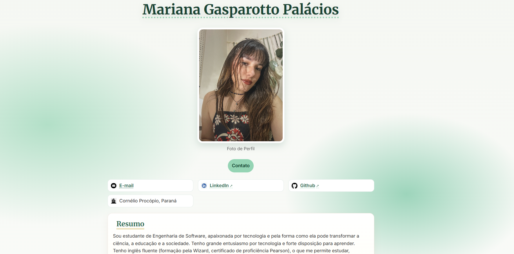

# 🌱 Currículo Online - Mariana Palácios

Projeto desenvolvido na disciplina **Programação Web Front-End**, do curso de **Engenharia de Software - UTFPR**.  
O objetivo foi criar um **currículo digital** utilizando apenas **HTML e CSS**, aplicando os conceitos aprendidos em aula sobre estrutura semântica, seletores, estilização de texto e uso de cores.

---

## ✨ Funcionalidades
- Estrutura semântica em **HTML5** (header, section, footer, figure).
- Design responsivo com **CSS puro**.
- Paleta de cores inspirada na **natureza** 🌿.
- Fundo artístico com **manchas em gradiente radial**.
- Tipografia do **Google Fonts** (Inter e Merriweather).
- Links para **e-mail, LinkedIn e GitHub**.
- Seções principais de um currículo:
  - Resumo
  - Habilidades
  - Educação
  - Hobbies
  - Links adicionais

---

## 📂 Estrutura do projeto

CurriculumVitae/

├── index.html # Estrutura da página

├── style.css # Estilos aplicados

└── figs/ # Imagens utilizadas (perfil, ícones, ODS, preview)


---

## 🖼️ Preview
Exemplo do currículo renderizado:




---

## 🚀 Como executar
1. Clone este repositório:
   ```bash
   git clone https://github.com/marianagpalacios/CurriculumVitae-FrontEnd.git
   
Acesse a pasta do projeto:

cd CurriculumVitae-FrontEnd


Abra o arquivo index.html no navegador ou use a extensão Live Server do VS Code para visualizar a página.

---

## 📚 Tecnologias utilizadas

HTML5

CSS3

Google Fonts

---

## 📖 Aprendizados

Este projeto foi construído como parte da disciplina Programação Web Front-End, aplicando:

Tipos de seletores CSS (elemento, classe, id, pseudo-classes).

Diferentes formas de estilizar texto (font-family, text-shadow, text-decoration).

Definição de cores usando valores hexadecimais, RGB e HSL.

Separação entre conteúdo (HTML) e apresentação (CSS).

Criação de um currículo digital estilizado com foco em boas práticas.

---

## 👩‍💻 Autora

Mariana Gasparotto Palácios

Acadêmica de Engenharia de Software - UTFPR
